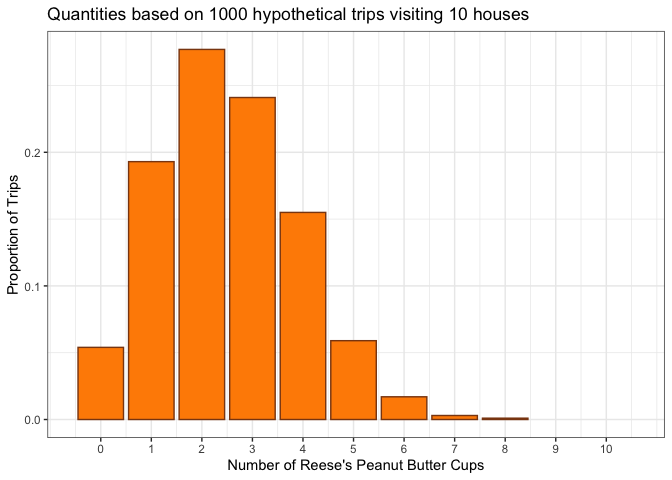
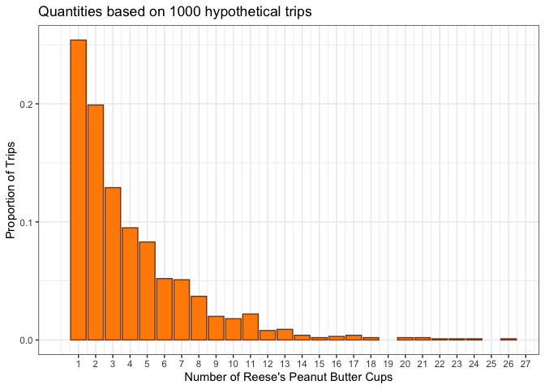

# R Functions


## Function overview

Functions in R are bundles of code that can be re-used. We have used
many functions, which are marked with a following parenthesis, in this
class.

For additional details on functions see [Chapter
25](https://r4ds.hadley.nz/functions) in the R for Data Science
textbook. The textbook states:

> > One of the best ways to improve your reach as a data scientist is to
> > write functions. Functions allow you to automate common tasks in a
> > more powerful and general way than copy-and-pasting. Writing a
> > function has four big advantages over using copy-and-paste:

1.  You can give a function an evocative name that makes your code
    easier to understand.

2.  As requirements change, you only need to update code in one place,
    instead of many.

3.  You eliminate the chance of making incidental mistakes when you copy
    and paste (i.e. updating a variable name in one place, but not in
    another).

4.  It makes it easier to reuse work from project-to-project, increasing
    your productivity over time.

A good rule of thumb is to consider writing a function whenever you’ve
copied and pasted a block of code more than twice (i.e. you now have
three copies of the same code).

## Writing R Functions

There are thee main components of an R Function:

1.  A name.

2.  The arguments or inputs.

3.  The body. Basic r code that is recreated.

Additionally, while not required, (4) documentation and (5) error
handling are also important.

### (3) Function Body

This is the basic R code that would otherwise be copied-and-pasted.

**Exercise:** Write code to randomly select a candy while
trick-or-treating. Assume you are drawing from a bag with Reese’s,
Snickers, m&ms, and Kit Kats where there are equal probabilities for all
candies.

**Solution:**

``` r
sample(c("Reese's", "Snickers", "m&ms", "Kit Kats"), 1)
```

    [1] "Reese's"

### (1) Function Name

Recall the RouletteSpin function from last week and note the structure
to define a function.

``` r
RouletteSpin <- function(num.spins){
  # function to simulate roulette spins
  # ARGS: number of spins
  # RETURNS: result of each spin
  outcomes <- tibble(number = c('00','0',
                as.character(1:36)),
                color=c('green','green','red','black','red','black',
                        'red','black','red','black','red','black',
                        'black','red','black','red','black',
                        'red','black','red','red','black',
                        'red','black','red','black','red',
                        'black','red','black','black','red',
                        'black','red','black','red','black','red'))
  return(outcomes[sample(38,num.spins,replace=T),])
}
```

``` r
name <- function(){
  
}
```

**Exercise:** Select a name for your function. Similar to naming
variables, this should be concise and meaningful. Verify your function
works by running it.

**Solution:**

``` r
get_candy <- function(){
  return(sample(c("Reese's", "Snickers", "m&ms", "Kit Kats"), 1))
}

get_candy()
```

    [1] "Kit Kats"

### (2) Function Arguments

Function arguments are inputs into the body of our R code. They allow us
to easily obtain different results without modifying the body of the
code.

**Exercise:** Add a function argument that enables you to select
multiple candies from the trick-or-treat basket. Verify you function
works by selecting 1, 5, and 10 candies.

**Solution:**

``` r
num_candy <- 3

get_candy <- function(num_candy){
  return(sample(c("Reese's", "Snickers", "m&ms", "Kit Kats"), num_candy, replace = T))
}

get_candy(1)
```

    [1] "m&ms"

``` r
get_candy(5)
```

    [1] "m&ms"     "Kit Kats" "Reese's"  "m&ms"     "Snickers"

``` r
get_candy(10)
```

     [1] "Kit Kats" "Kit Kats" "Reese's"  "Kit Kats" "Reese's"  "m&ms"    
     [7] "m&ms"     "Reese's"  "Snickers" "m&ms"    

### (4) Function Documentation

There are multiple ways to document functions. Here will use basic
comments with the following structure

1.  a one-sentence description;
2.  a list of the functions arguments, denoted by `Args:`, with a
    description of each and
3.  a description of the return value, denoted by `Returns:`.

The comments should be descriptive enough that the function can be used
without reading the function code.

**Exercise:** Add these three documentation elements to your function.

**Solution:**

``` r
get_candy <- function(num_candy){
  # A function to randomly select candy from a bag consisting of Reeses, Snickers, M&Ms, and Kit Kats
  # Args: num_candy - the number of candy pieces to select
  # Returns: vector of candy bar names with length equal to num_candy
  return(sample(c("Reese's", "Snickers", "m&ms", "Kit Kats"), num_candy, replace = T))
}
```

### (5) Error / Warning Documentation

We have seen errors, warnings, and messages throughout the course.

`stop()` triggers errors and ends the function call. You should also
enter descriptive text inside the function name to create an informative
message.

**Exercise:** Add a error message that catches cases where the user
enters a non-numeric argument into your function. Hint: `is.numeric()`
may be useful. Demonstrate that your error function works.

**Solution:**

``` r
get_candy <- function(num_candy){
  # A function to randomly select candy from a bag consisting of Reeses, Snickers, M&Ms, and Kit Kats
  # Args: num_candy - the number of candy pieces to select
  # Returns: vector of candy bar names with length equal to num_candy
  if(!is.numeric(num_candy)) {
    stop('Please enter a numeric value for number of candy')
  }
  return(sample(c("Reese's", "Snickers", "m&ms", "Kit Kats"), num_candy, replace = T))
}

get_candy('5')
```

    Error in get_candy("5"): Please enter a numeric value for number of candy

**Exercise:** Add a warning message that catches cases where the user
tries to take more than 5 pieces of candy..

``` r
get_candy <- function(num_candy){
  # A function to randomly select candy from a bag consisting of Reeses, Snickers, M&Ms, and Kit Kats
  # Args: num_candy - the number of candy pieces to select
  # Returns: vector of candy bar names with length equal to num_candy
  if(!is.numeric(num_candy)) {
    stop('Please enter a numeric value for number of candy')
  }
  if(num_candy > 5){
    warning("Sugar Rush! Are you sure you want to do that?")
  }
  return(sample(c("Reese's", "Snickers", "m&ms", "Kit Kats"), num_candy, replace = T))
}

get_candy(6)
```

    Warning in get_candy(6): Sugar Rush! Are you sure you want to do that?

    [1] "Snickers" "Reese's"  "Kit Kats" "Snickers" "Snickers" "m&ms"    

------------------------------------------------------------------------

Use your function, Monte Carlo principles, and data visualization skills
to answer the following question:

1.  Show the distribution of how many Reese’s peanut butter cups you’d
    expect after visiting 10 houses.

``` r
num_trips <- 1000
num_pb <- rep(0, num_trips)

for (trip in 1:num_trips){
  num_pb[trip] <- sum(get_candy(10) == "Reese's")
}

library(tidyverse)
tibble(num_pb) |> 
  ggplot(aes(x = num_pb)) +
  geom_bar(aes(y = after_stat(prop)),
           fill = 'darkorange',
           color = 'chocolate4') +
  scale_x_continuous(breaks = 0:10,
                     limits = c(-.5,10.6)) +
  ylab('Proportion of Trips') +
  xlab("Number of Reese's Peanut Butter Cups") +
  labs(title = 'Quantities based on 1000 hypothetical trips visiting 10 houses') +
  theme_bw() 
```



2.  Show the distribution of how many houses you’d need to visit to get
    your first Reese’s peanut butter cup. Start by writing a function to
    calculate how many houses you visit to get a single Reese’s

``` r
want_reeses <- function(){
  # function to calculate how many houses to get a Reese's
  need_pb <- TRUE
  num_houses <- 0
  while (need_pb){
    candy <- get_candy(1)
   # print(candy)
    if (candy == "Reese's"){
      num_houses <- num_houses + 1
      need_pb <- FALSE
    } else{
      num_houses <- num_houses + 1
    }
  }
  return(num_houses)
}

want_reeses()
```

    [1] 2

``` r
num_trips <- 1000
num_houses <- rep(0, num_trips)

for (trip in 1:num_trips){
  num_houses[trip] <- want_reeses()
}

library(tidyverse)
tibble(num_houses = num_houses) |> 
  ggplot(aes(x =  num_houses)) +
  geom_bar(aes(y = after_stat(prop)),
           fill = 'darkorange',
           color = 'chocolate4') +
  scale_x_continuous(breaks = 1:100,
                     limits = c(0,NA)) +
  ylab('Proportion of Trips') +
  xlab("Number of Reese's Peanut Butter Cups") +
  labs(title = 'Quantities based on 1000 hypothetical trips') +
  theme_bw()
```



num_houses
